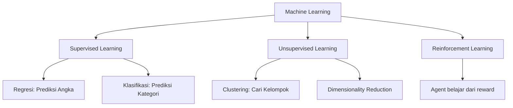

# Module 01 Slide Deck Implementation Plan

> **For agentic workers:** REQUIRED SUB-SKILL: Use superpowers:subagent-driven-development (recommended) or superpowers:executing-plans to implement this plan task-by-task. Steps use checkbox (`- [ ]`) syntax for tracking.

**Goal:** Create a ~45 slide LaTeX Beamer presentation covering all 10 notebooks of Module 01 (ML Fundamentals) with NVIDIA dark branding, story-driven narrative, and Python/TikZ visualizations.

**Architecture:** Single .tex file with Python-generated figures (PDF) and Mermaid-generated diagrams (PNG). Build script orchestrates figure generation then LaTeX compilation.

**Tech Stack:** LaTeX Beamer + xelatex, Python 3 (matplotlib/seaborn/sklearn), Mermaid CLI (mmdc), TikZ

---

## File Structure

```
01_machine_learning_fundamentals/slides/
  module01_slides.tex              # Main Beamer file (~45 slides)
  figures/
    gen_regression_line.py         # Python: scatter + best fit line
    gen_decision_boundaries.py     # Python: 4-model comparison
    gen_overfitting_panels.py      # Python: underfit/optimal/overfit
    gen_clusters.py                # Python: K-Means visualization
    gen_gpu_speedup.py             # Python: CPU vs GPU bar chart
    mermaid_ml_types.mmd           # Mermaid: supervised/unsupervised diagram
    mermaid_boosting.mmd           # Mermaid: boosting iterative process
  build.sh                         # Orchestrator script
```

---

### Task 1: Directory Structure + Build Script

**Files:**
- Create: `01_machine_learning_fundamentals/slides/build.sh`
- Create: `01_machine_learning_fundamentals/slides/figures/` (directory)

- [ ] **Step 1: Create directory structure**

```bash
mkdir -p 01_machine_learning_fundamentals/slides/figures
```

- [ ] **Step 2: Create build.sh**

```bash
#!/bin/bash
set -e
cd "$(dirname "$0")"

echo "=== Step 1: Generate Python figures ==="
PYTHON=${PYTHON:-python3}
for script in figures/gen_*.py; do
    if [ -f "$script" ]; then
        echo "  Running $script..."
        $PYTHON "$script"
    fi
done

echo "=== Step 2: Generate Mermaid diagrams ==="
MMDC=${MMDC:-/opt/homebrew/bin/mmdc}
for mmd in figures/*.mmd; do
    if [ -f "$mmd" ]; then
        out="${mmd%.mmd}.png"
        echo "  Converting $mmd → $out..."
        $MMDC -i "$mmd" -o "$out" -s 3 -b transparent 2>/dev/null
    fi
done

echo "=== Step 3: Compile LaTeX ==="
xelatex -interaction=nonstopmode -halt-on-error module01_slides.tex
xelatex -interaction=nonstopmode -halt-on-error module01_slides.tex

echo "=== Done! Output: module01_slides.pdf ==="
```

- [ ] **Step 3: Make executable and commit**

```bash
chmod +x 01_machine_learning_fundamentals/slides/build.sh
git add 01_machine_learning_fundamentals/slides/build.sh
git commit -m "chore: scaffold slide deck directory and build script"
```

---

### Task 2: Python Figure — Regression Line

**Files:**
- Create: `01_machine_learning_fundamentals/slides/figures/gen_regression_line.py`
- Output: `01_machine_learning_fundamentals/slides/figures/regression_line.pdf`

- [ ] **Step 1: Write figure generation script**

Script generates synthetic data, fits linear regression, plots scatter + line on dark background matching slide theme (#1A1A2E). Saves as PDF for crisp vector graphics in LaTeX.

Key requirements:
- Dark background (#1A1A2E), white text, NVIDIA green (#76B900) for regression line
- Scatter points in light green (#A3D944), regression line in NVIDIA green
- Labels in Bahasa Indonesia: "Budget Iklan TV", "Penjualan"
- Figure size: 6x4 inches, 150 DPI
- Save to `figures/regression_line.pdf`

- [ ] **Step 2: Run and verify output**

```bash
cd 01_machine_learning_fundamentals/slides
python3 figures/gen_regression_line.py
ls -la figures/regression_line.pdf
```

- [ ] **Step 3: Commit**

```bash
git add figures/gen_regression_line.py figures/regression_line.pdf
git commit -m "feat(slides): add regression line figure"
```

---

### Task 3: Python Figure — Decision Boundaries (4 models)

**Files:**
- Create: `01_machine_learning_fundamentals/slides/figures/gen_decision_boundaries.py`
- Output: `01_machine_learning_fundamentals/slides/figures/decision_boundaries.pdf`

- [ ] **Step 1: Write figure generation script**

Generates `make_moons` data, trains 4 models (Decision Tree, KNN, SVM Linear, SVM RBF), plots 4-panel decision boundaries side-by-side.

Key requirements:
- Dark background, 4 subplots in 1 row (2x2 or 1x4)
- Each panel labeled with model name + accuracy
- Red/green colormap for class regions
- White scatter points with colored edges
- Figure size: 12x3 inches (1x4 layout)
- Save to `figures/decision_boundaries.pdf`

- [ ] **Step 2: Run and verify**

```bash
python3 figures/gen_decision_boundaries.py
ls -la figures/decision_boundaries.pdf
```

- [ ] **Step 3: Commit**

```bash
git add figures/gen_decision_boundaries.py figures/decision_boundaries.pdf
git commit -m "feat(slides): add decision boundary comparison figure"
```

---

### Task 4: Python Figure — Overfitting Panels

**Files:**
- Create: `01_machine_learning_fundamentals/slides/figures/gen_overfitting_panels.py`
- Output: `01_machine_learning_fundamentals/slides/figures/overfitting_panels.pdf`

- [ ] **Step 1: Write figure generation script**

3-panel comparison using KNN on make_moons: K=1 (overfitting), K=optimal (just right), K=large (underfitting).

Key requirements:
- Dark background, 3 subplots
- Titles: "Underfitting", "Optimal", "Overfitting" with colored indicators (red/green/red)
- Show train vs test accuracy in each title
- Figure size: 12x4 inches
- Save to `figures/overfitting_panels.pdf`

- [ ] **Step 2: Run and verify, then commit**

```bash
python3 figures/gen_overfitting_panels.py
git add figures/gen_overfitting_panels.py figures/overfitting_panels.pdf
git commit -m "feat(slides): add overfitting comparison figure"
```

---

### Task 5: Python Figure — K-Means Clusters

**Files:**
- Create: `01_machine_learning_fundamentals/slides/figures/gen_clusters.py`
- Output: `01_machine_learning_fundamentals/slides/figures/clusters.pdf`

- [ ] **Step 1: Write figure generation script**

Generate synthetic blob data (make_blobs), run K-Means, plot colored clusters with centroids.

Key requirements:
- Dark background
- 3-5 clusters with distinct colors (Set2 colormap)
- Centroids marked with red X
- Figure size: 6x5 inches
- Save to `figures/clusters.pdf`

- [ ] **Step 2: Run and verify, then commit**

```bash
python3 figures/gen_clusters.py
git add figures/gen_clusters.py figures/clusters.pdf
git commit -m "feat(slides): add K-Means cluster figure"
```

---

### Task 6: Python Figure — GPU Speedup Chart

**Files:**
- Create: `01_machine_learning_fundamentals/slides/figures/gen_gpu_speedup.py`
- Output: `01_machine_learning_fundamentals/slides/figures/gpu_speedup.pdf`

- [ ] **Step 1: Write figure generation script**

Bar chart comparing CPU vs GPU training time for 6 algorithms. Uses representative benchmark numbers (not live — slide figure).

Key requirements:
- Dark background
- Horizontal bar chart: CPU bars in red (#EF5350), GPU bars in NVIDIA green (#76B900)
- Speedup labels (e.g., "5.2x") at end of each GPU bar
- Algorithms: Linear Reg, Random Forest, KNN, K-Means, PCA, XGBoost
- Use realistic benchmark ratios (from notebook 10 results or typical values)
- Figure size: 8x5 inches
- Save to `figures/gpu_speedup.pdf`

- [ ] **Step 2: Run and verify, then commit**

```bash
python3 figures/gen_gpu_speedup.py
git add figures/gen_gpu_speedup.py figures/gpu_speedup.pdf
git commit -m "feat(slides): add GPU speedup benchmark chart"
```

---

### Task 7: Mermaid Diagrams

**Files:**
- Create: `01_machine_learning_fundamentals/slides/figures/mermaid_ml_types.mmd`
- Create: `01_machine_learning_fundamentals/slides/figures/mermaid_boosting.mmd`
- Output: `figures/mermaid_ml_types.png`, `figures/mermaid_boosting.png`

- [ ] **Step 1: Create ML Types diagram (Supervised/Unsupervised)**



- [ ] **Step 2: Create Boosting diagram**


- [ ] **Step 3: Generate PNGs with mmdc**

```bash
cd 01_machine_learning_fundamentals/slides
/opt/homebrew/bin/mmdc -i figures/mermaid_ml_types.mmd -o figures/mermaid_ml_types.png -s 3 -b transparent
/opt/homebrew/bin/mmdc -i figures/mermaid_boosting.mmd -o figures/mermaid_boosting.png -s 3 -b transparent
```

- [ ] **Step 4: Commit**

```bash
git add figures/mermaid_*.mmd figures/mermaid_*.png
git commit -m "feat(slides): add Mermaid diagrams for ML types and boosting"
```

---

### Task 8: LaTeX Beamer — Preamble + Theme + Act 1

**Files:**
- Create: `01_machine_learning_fundamentals/slides/module01_slides.tex`

- [ ] **Step 1: Write preamble with NVIDIA dark theme**

Custom Beamer theme with:
- Background: #1A1A2E
- Text: white
- Accent: NVIDIA green #76B900
- FiraSans font family
- Footer with slide numbers + course title
- Code listing style with dark background
- Act transition slide template

- [ ] **Step 2: Write Act 1 slides (5 slides)**

1. Title slide: "Machine Learning Fundamentals", NCA-GENL Navasena, NVIDIA partner
2. "Apa itu ML?" — Spotify/spam analogy
3. Supervised vs Unsupervised — include mermaid_ml_types.png
4. Roadmap Modul 01 — TikZ timeline (10 sessions)
5. Tools — Python, sklearn, Google Colab, NVIDIA GPU

- [ ] **Step 3: Test compile**

```bash
cd 01_machine_learning_fundamentals/slides
xelatex -interaction=nonstopmode module01_slides.tex
```

- [ ] **Step 4: Commit**

```bash
git add module01_slides.tex
git commit -m "feat(slides): beamer preamble + NVIDIA theme + Act 1"
```

---

### Task 9: LaTeX Beamer — Act 2 (Menebak Angka)

**Files:**
- Modify: `01_machine_learning_fundamentals/slides/module01_slides.tex`

- [ ] **Step 1: Write Act 2 slides (6 slides)**

1. Act 2 transition: "Menebak Angka — Bagaimana memprediksi nilai?"
2. Linear Regression — include regression_line.pdf, formula y = wx + b
3. Evaluasi model — R², MAE, RMSE with simple explanations
4. Time Series — seasonal pattern illustration (TikZ sine wave + trend)
5. SARIMA forecast — TikZ illustration of forecast + confidence interval
6. Act 2 summary

- [ ] **Step 2: Compile and verify**

```bash
xelatex -interaction=nonstopmode module01_slides.tex
```

- [ ] **Step 3: Commit**

```bash
git add module01_slides.tex
git commit -m "feat(slides): Act 2 - regression and time series"
```

---

### Task 10: LaTeX Beamer — Act 3 (Menebak Kategori)

**Files:**
- Modify: `01_machine_learning_fundamentals/slides/module01_slides.tex`

- [ ] **Step 1: Write Act 3 slides (10 slides)**

1. Act 3 transition: "Menebak Kategori — Ya atau Tidak?"
2. Klasifikasi vs Regresi — comparison diagram (TikZ)
3. Logistic Regression — sigmoid curve (TikZ)
4. Confusion Matrix — TP/TN/FP/FN with COVID analogy (TikZ table)
5. Decision Tree — TikZ tree diagram
6. KNN — "siapa tetanggamu?" TikZ illustration
7. SVM — margin + support vectors (TikZ)
8. 4-model comparison — include decision_boundaries.pdf
9. Overfitting — include overfitting_panels.pdf
10. Kapan pakai apa? — summary table

- [ ] **Step 2: Compile and verify, then commit**

```bash
xelatex -interaction=nonstopmode module01_slides.tex
git add module01_slides.tex
git commit -m "feat(slides): Act 3 - classification models"
```

---

### Task 11: LaTeX Beamer — Act 4 (Kekuatan Tim)

**Files:**
- Modify: `01_machine_learning_fundamentals/slides/module01_slides.tex`

- [ ] **Step 1: Write Act 4 slides (8 slides)**

1. Act 4 transition: "Kekuatan Tim — Bagaimana jika model bekerja sama?"
2. Voting analogy — TikZ diagram (3 models voting)
3. Bagging & Random Forest — TikZ diagram (many trees → combine)
4. Boosting — include mermaid_boosting.png
5. XGBoost — Kaggle champion facts
6. Feature Importance — TikZ horizontal bar chart
7. No Free Lunch — comparison table
8. Act 4 summary

- [ ] **Step 2: Compile and verify, then commit**

```bash
xelatex -interaction=nonstopmode module01_slides.tex
git add module01_slides.tex
git commit -m "feat(slides): Act 4 - ensemble methods"
```

---

### Task 12: LaTeX Beamer — Act 5 (Pola Tersembunyi)

**Files:**
- Modify: `01_machine_learning_fundamentals/slides/module01_slides.tex`

- [ ] **Step 1: Write Act 5 slides (5 slides)**

1. Act 5 transition: "Menemukan Pola Tersembunyi — tanpa dikasih tahu jawabannya"
2. K-Means — include clusters.pdf + magnet analogy
3. Elbow & Silhouette — TikZ dual chart illustration
4. Hierarchical & DBSCAN — TikZ dendrogram + outlier concept
5. Act 5 summary

- [ ] **Step 2: Compile and verify, then commit**

```bash
xelatex -interaction=nonstopmode module01_slides.tex
git add module01_slides.tex
git commit -m "feat(slides): Act 5 - clustering"
```

---

### Task 13: LaTeX Beamer — Act 6 (NVIDIA GPU) + Closing

**Files:**
- Modify: `01_machine_learning_fundamentals/slides/module01_slides.tex`

- [ ] **Step 1: Write Act 6 slides (8 slides)**

1. Act 6 transition: "Turbo Mode — Akselerasi dengan NVIDIA GPU"
2. CPU vs GPU — TikZ analogy (1 chef vs 1000 chefs)
3. cuML — code comparison (listings, sklearn vs cuML side-by-side)
4. XGBoost GPU — 1-line change code listing
5. Benchmark — include gpu_speedup.pdf
6. ONNX deployment — TikZ pipeline diagram
7. NVIDIA ecosystem — table
8. Act 6 summary

- [ ] **Step 2: Write Closing slides (3 slides)**

1. Full module summary — table of 10 topics
2. What's next — TikZ course roadmap (6 modules, Module 1 highlighted)
3. Thank you slide

- [ ] **Step 3: Final compile (2 passes for references)**

```bash
xelatex -interaction=nonstopmode module01_slides.tex
xelatex -interaction=nonstopmode module01_slides.tex
```

- [ ] **Step 4: Commit**

```bash
git add module01_slides.tex
git commit -m "feat(slides): Act 6 NVIDIA GPU + closing slides - complete deck"
```

---

### Task 14: Final Build + Polish

**Files:**
- Modify: any files needing adjustments
- Output: `01_machine_learning_fundamentals/slides/module01_slides.pdf`

- [ ] **Step 1: Run full build script**

```bash
cd 01_machine_learning_fundamentals/slides
./build.sh
```

- [ ] **Step 2: Verify PDF**

- Check total page count (~45)
- Verify all figures render correctly
- Check no LaTeX warnings about missing figures
- Verify PDF size < 20MB

- [ ] **Step 3: Add PDF to gitignore, final commit**

```bash
echo "01_machine_learning_fundamentals/slides/module01_slides.pdf" >> .gitignore
echo "01_machine_learning_fundamentals/slides/*.aux" >> .gitignore
echo "01_machine_learning_fundamentals/slides/*.log" >> .gitignore
echo "01_machine_learning_fundamentals/slides/*.nav" >> .gitignore
echo "01_machine_learning_fundamentals/slides/*.out" >> .gitignore
echo "01_machine_learning_fundamentals/slides/*.snm" >> .gitignore
echo "01_machine_learning_fundamentals/slides/*.toc" >> .gitignore
echo "01_machine_learning_fundamentals/slides/*.vrb" >> .gitignore
git add -A
git commit -m "feat(slides): complete Module 01 slide deck with all figures"
```

- [ ] **Step 4: Push**

```bash
git push origin master
```
